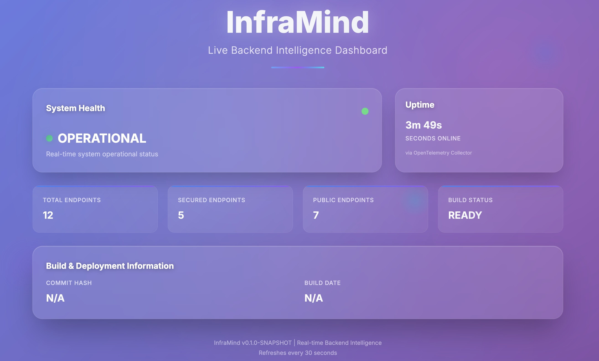
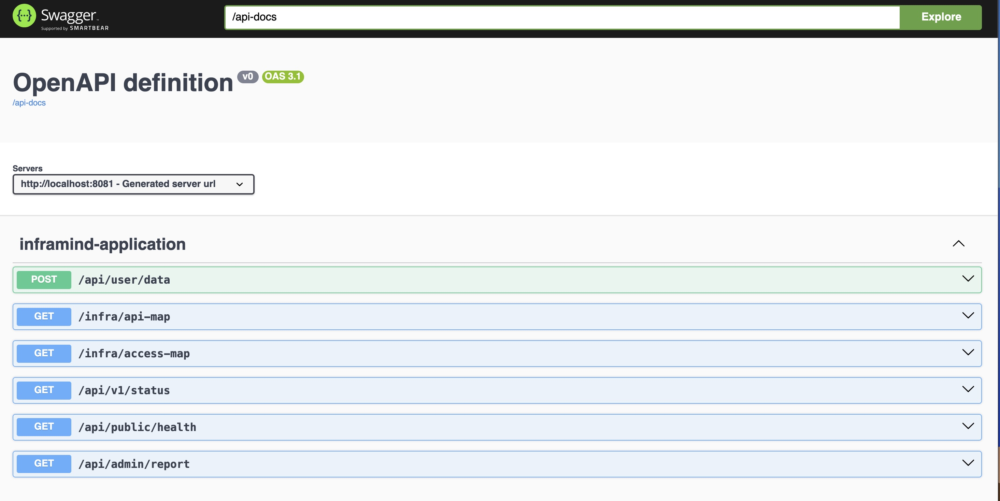

# InfraMind - The Self-Healing Backend Brain

[](https://github.com/ahammednibras8/InfraMind/actions)
[](https://www.docker.com/)
[](https://spring.io/projects/spring-boot)

> **InfraMind isn't just a tool. It's a mirror for broken backends.**

A precision-engineered backend operating system that auto-documents, auto-heals, and auto-exposes what the hell is really happening in your backend. Transform opaque operations into crystal-clear intelligence.

## What is InfraMind?

InfraMind is a Spring Boot-powered backend framework that eliminates the guesswork from backend operations. It provides surgical control over your system by automatically mapping your API endpoints, visualizing access controls, and exposing real-time system health—all without manual configuration.

## Why InfraMind Exists

Most engineering teams are drowning in **invisible complexity**:

- **Fragile Microservices**: Your backend is a house of cards where minor changes trigger cascading failures
- **Sloppy Security**: Who has access to what? It's a mystery until a breach exposes your blind spots
- **Non-existent Observability**: You're flying blind, reacting to outages instead of predicting them
- **Hidden System State**: The true state of your backend is invisible, forcing endless debugging cycles

InfraMind weaponizes your backend, giving you the commander's view to preempt problems before they cripple your operations.

## What InfraMind Does (Plain English)

**Live API Intelligence**: Forget outdated documentation. InfraMind auto-generates a living map of every endpoint, its usage patterns, and current status—always synced with your code.

**Smart Security Visualization**: See exactly who can access what within your system. No more security vulnerabilities lurking in undocumented access rules.

**Real-time System Pulse**: Get instant visibility into your backend's vital signs—latency, errors, memory, CPU—the metrics you need to make decisions.

**Automated Deployment Pipeline**: Deploy with confidence using integrated CI/CD that ensures your backend is always stable and battle-ready.

**Foundation for Prediction**: Continuously collect critical data to identify failure patterns and enable automated root cause analysis.

## Who InfraMind is For

**Solo Founders**: Tired of duct-taping their backend together and losing sleep over invisible issues.

**Series A Startups**: Struggling with bloated systems, scaling pains, and lack of visibility into growing infrastructure.

**Backend Engineers & SREs**: Who need immediate results and a backend that talks back to them—not one that requires deciphering tribal knowledge.

## 📸 Intelligence Briefing

### InfraMind Dashboard: Your Commander's View


### Live API Map: Know Every Endpoint
```
[
  {
    "urls": [
      "/api/v1/status"
    ],
    "httpMethods": [
      "GET"
    ],
    "rolesAllowed": [
      "hasRole",
      "ADMIN"
    ],
    "controllerMethods": "com.inframind.InframindApplication::getStatus"
  },
  {
    "urls": [
      "/swagger-ui.html"
    ],
    "httpMethods": [
      "GET"
    ],
    "rolesAllowed": [
      "UNSECURED_OR_DEFAULT_SECURED"
    ],
    "controllerMethods": "org.springdoc.webmvc.ui.SwaggerWelcomeWebMvc::redirectToUi"
  },
  {
    "urls": [
      "/api-docs"
    ],
    "httpMethods": [
      "GET"
    ],
    "rolesAllowed": [
      "UNSECURED_OR_DEFAULT_SECURED"
    ],
    "controllerMethods": "org.springdoc.webmvc.api.OpenApiWebMvcResource::openapiJson"
  },
  {
    "urls": [
      "/api-docs/swagger-config"
    ],
    "httpMethods": [
      "GET"
    ],
    "rolesAllowed": [
      "UNSECURED_OR_DEFAULT_SECURED"
    ],
    "controllerMethods": "org.springdoc.webmvc.ui.SwaggerConfigResource::openapiJson"
  },
  {
    "urls": [
      "/infra/api-map"
    ],
    "httpMethods": [
      "GET"
    ],
    "rolesAllowed": [
      "hasRole",
      "ADMIN"
    ],
    "controllerMethods": "com.inframind.InframindApplication::getApiMap"
  },
  {
    "urls": [
      "/api/admin/report"
    ],
    "httpMethods": [
      "GET"
    ],
    "rolesAllowed": [
      "hasRole",
      "ADMIN"
    ],
    "controllerMethods": "com.inframind.InframindApplication::getAdminReport"
  },
  {
    "urls": [
      "/error"
    ],
    "httpMethods": [
      "ANY"
    ],
    "rolesAllowed": [
      "UNSECURED_OR_DEFAULT_SECURED"
    ],
    "controllerMethods": "org.springframework.boot.autoconfigure.web.servlet.error.BasicErrorController::error"
  },
  {
    "urls": [
      "/api/user/data"
    ],
    "httpMethods": [
      "POST"
    ],
    "rolesAllowed": [
      "hasAnyRole",
      "USER",
      "ADMIN"
    ],
    "controllerMethods": "com.inframind.InframindApplication::postUserData"
  },
  {
    "urls": [
      "/api/public/health"
    ],
    "httpMethods": [
      "GET"
    ],
    "rolesAllowed": [
      "UNSECURED_OR_DEFAULT_SECURED"
    ],
    "controllerMethods": "com.inframind.InframindApplication::publicHealthCheck"
  },
  {
    "urls": [
      "/infra/access-map"
    ],
    "httpMethods": [
      "GET"
    ],
    "rolesAllowed": [
      "hasRole",
      "ADMIN"
    ],
    "controllerMethods": "com.inframind.InframindApplication::getAccessMap"
  },
  {
    "urls": [
      "/api-docs.yaml"
    ],
    "httpMethods": [
      "GET"
    ],
    "rolesAllowed": [
      "UNSECURED_OR_DEFAULT_SECURED"
    ],
    "controllerMethods": "org.springdoc.webmvc.api.OpenApiWebMvcResource::openapiYaml"
  },
  {
    "urls": [
      "/error"
    ],
    "httpMethods": [
      "ANY"
    ],
    "rolesAllowed": [
      "UNSECURED_OR_DEFAULT_SECURED"
    ],
    "controllerMethods": "org.springframework.boot.autoconfigure.web.servlet.error.BasicErrorController::errorHtml"
  }
]
```

### RBAC Visualizer: Unmasking Access Logic
```
[
  {
    "endpoint": "/api/v1/status",
    "method": "GET",
    "roles": [
      "hasRole",
      "ADMIN"
    ]
  },
  {
    "endpoint": "/swagger-ui.html",
    "method": "GET",
    "roles": [
      "NONE_EXPLICITLY_REQUIRED"
    ]
  },
  {
    "endpoint": "/api-docs",
    "method": "GET",
    "roles": [
      "NONE_EXPLICITLY_REQUIRED"
    ]
  },
  {
    "endpoint": "/api-docs/swagger-config",
    "method": "GET",
    "roles": [
      "NONE_EXPLICITLY_REQUIRED"
    ]
  },
  {
    "endpoint": "/infra/api-map",
    "method": "GET",
    "roles": [
      "hasRole",
      "ADMIN"
    ]
  },
  {
    "endpoint": "/api/admin/report",
    "method": "GET",
    "roles": [
      "hasRole",
      "ADMIN"
    ]
  },
  {
    "endpoint": "/api/user/data",
    "method": "POST",
    "roles": [
      "hasAnyRole",
      "USER",
      "ADMIN"
    ]
  },
  {
    "endpoint": "/api/public/health",
    "method": "GET",
    "roles": [
      "NONE_EXPLICITLY_REQUIRED"
    ]
  },
  {
    "endpoint": "/infra/access-map",
    "method": "GET",
    "roles": [
      "hasRole",
      "ADMIN"
    ]
  },
  {
    "endpoint": "/api-docs.yaml",
    "method": "GET",
    "roles": [
      "NONE_EXPLICITLY_REQUIRED"
    ]
  }
]
```

### Auto-Updating Documentation: Always Current


## 🚀 Quick Start

### Prerequisites
- Docker & Docker Compose V2
- 2GB+ RAM recommended

### Deploy in 2 Minutes

```bash
# Clone the battlefield
git clone https://github.com/ahammednibras8/InfraMind.git
cd InfraMind

# Download OpenTelemetry Java Agent
curl -L -o javaagent/opentelemetry-javaagent.jar \
  https://github.com/open-telemetry/opentelemetry-javaagent/releases/latest/download/opentelemetry-javaagent.jar

# Deploy the full stack
docker-compose up --build -d

# Wait 30 seconds for services to start

# Verify InfraMind is operational
curl http://localhost:8081/api/public/health
```

### Access Your Command Center
- **InfraMind Application**: http://localhost:8081
- **Live API Documentation**: http://localhost:8081/swagger-ui.html
- **Distributed Tracing**: http://localhost:16686
- **Metrics Dashboard**: http://localhost:9090

## 📡 Command Interface (API Endpoints)

### Core Operations
```
GET  /api/public/health     # Public health check
GET  /api/v1/status         # System status (Admin only)
GET  /api/admin/report      # Critical admin report (Admin only)
POST /api/user/data         # User data operations
```

### InfraMind Intelligence Layer (Admin Only)
```
GET /infra/api-map          # Live API endpoint mapping
GET /infra/access-map       # RBAC visualization
```

### Observability & Management
```
GET /actuator/health        # Detailed health information
GET /actuator/info          # Application build information
GET /actuator/metrics       # Available system metrics
GET /actuator/prometheus    # Prometheus-formatted metrics
```

## 🏗️ Battle-Tested Architecture

```
InfraMind Stack
├── Spring Boot 3.x          # Core framework foundation
├── Spring Security          # Fortress-grade authentication
├── Spring Actuator          # Operational intelligence
├── Docker + Compose         # Portable deployment
├── GitHub Actions           # Automated CI/CD pipeline
├── Springdoc OpenAPI        # Live API documentation
├── Micrometer + Prometheus  # Metrics collection & exposure
├── OpenTelemetry            # Distributed tracing
├── OpenTelemetry Collector  # Observability data processing
└── Jaeger                   # Visual trace analysis
```

## 🚦 Automated Supply Lines (CI/CD)

The GitHub Actions pipeline ensures rapid, reliable delivery:

1. **Automated Builds**: Build Spring Boot JAR on every push
2. **Docker Image Creation**: Generate latest application images
3. **Full Stack Testing**: Deploy entire stack for integration testing
4. **Health Verification**: Confirm application operational status
5. **API Map & Info Endpoint Checks**: Ensure `/infra/api-map` (admin) and `/actuator/info` (public) return 200 OK
6. **Metrics Validation**: Ensure observability data flows correctly
7. **Traffic Simulation**: Generate realistic load for end-to-end validation
8. **Automatic Cleanup**: Clean teardown after successful validation

**Pipeline Performance**: < 5 minutes build-to-deploy

## 🔒 Security: Building the Fortress

**Multi-layer Defense**:
- Role-based access control (RBAC) with ADMIN and USER roles
- Endpoint-level authorization using Spring Security
- Secure actuator endpoints with controlled access
- Comprehensive audit trails through distributed tracing

**Default Development Credentials**:
- Admin: `admin:password`
- User: `user:userpass`

## 🛡️ CORS & Security Configuration

- **CORS is handled exclusively via Spring Security configuration** in `SecurityConfig.java` using `setAllowedOriginPatterns(["*"])` and `setAllowCredentials(true)`.
- **Do NOT** use additional `WebMvcConfigurer` CORS beans/classes, as this can cause conflicts and 500 errors.
- The CI pipeline will catch CORS or backend errors on `/infra/api-map` and `/actuator/info` endpoints.

## 🧰 Troubleshooting

**500 Error on /infra/api-map or CORS errors?**
- Ensure you have **removed any extra CORS config** (such as a `WebMvcConfigurer` bean/class) and only use the CORS config in `SecurityConfig.java`.
- The correct config is:
  ```java
  configuration.setAllowedOriginPatterns(Arrays.asList("*"));
  configuration.setAllowCredentials(true);
  ```
- If you see an error like:
  > When allowCredentials is true, allowedOrigins cannot contain the special value "*"
  You have a conflicting or legacy CORS config. Remove `.allowedOrigins("*")` from your codebase.
- After fixing, **rebuild and restart** your app and Docker containers.

## 📋 System Requirements

**Development Environment**:
- Java 21+
- Maven 3.8+
- Docker 20.0+ with Compose V2

**Production Baseline**:
- 2GB+ RAM
- Ports: 8081, 9090, 16686, 4317, 4318

## 📞 Command Structure

- **Project Lead**: [@ahammednibras8](https://github.com/ahammednibras8)
- **Repository**: [InfraMind](https://github.com/ahammednibras8/InfraMind)
- **Issues**: [GitHub Issues](https://github.com/ahammednibras8/InfraMind/issues)

## 🏆 Version

**InfraMind v0.1.0-SNAPSHOT** | Built for Backend Excellence

---

### Mission Motto
*"Precision over Perfection, Deployment over Discussion"*

**Next Milestone**: Day 21 - Full MVP Deployment Ready